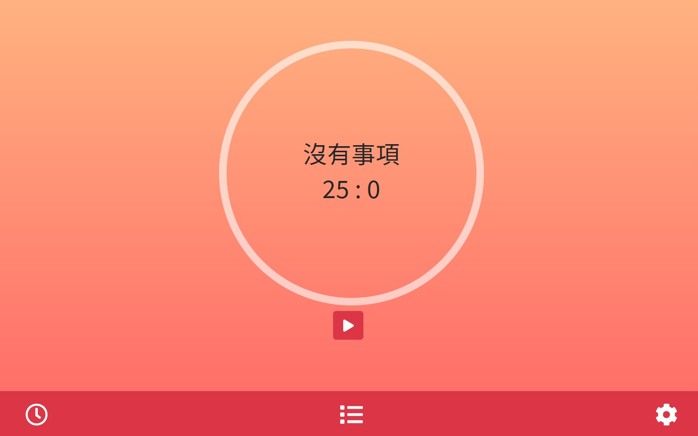
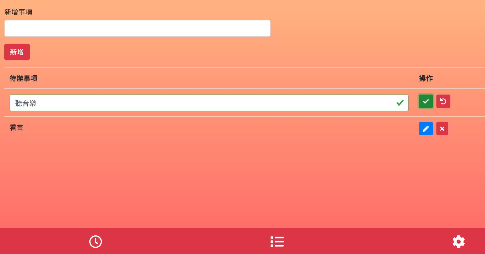
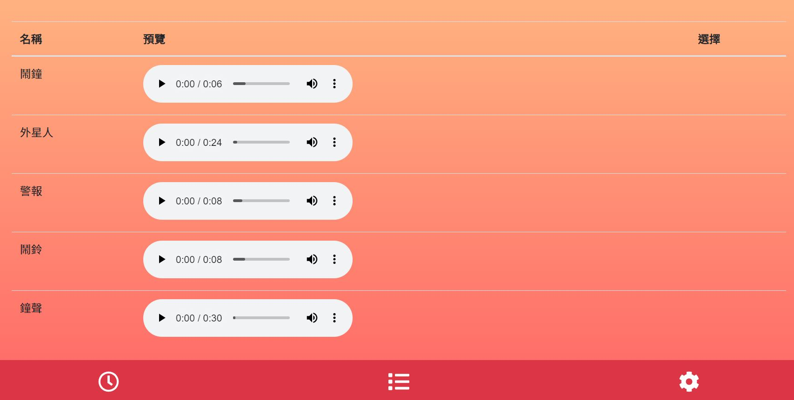

# 番茄鐘

## 分成 Home、List、Setting 頁面

- Home:
  
  可開始、暫停、繼續倒數、略過倒數
- List:
  
  可自訂待辦事項時間
  可編輯、刪除待辦事項內容
- Setting:
  
  多種鈴聲選一種當響鈴

## 支援 PWA

## 使用工具

- Vue cli
- Vuex 和 VueRouter

## 引用套件

- bootstrap-vue
- FontAwesomeIcon
